# Learned Heuristic A* Pathfinding on Quake 1 BSP Geometry

A personal exploration of learned heuristic search, built on top of real 3D game geometry extracted directly from Quake 1's binary map format. The core idea is that the euclidean distance heuristic standard A* relies on consistently underestimates true path costs in complex environments, sometimes by a factor of 20 or more. This project trains a correction factor model that learns to predict how much the straight-line estimate is off, given the local geometry around each node pair.

The result is a near-admissible heuristic that reduces the number of nodes A* expands by around **42%** on average across 38 maps, while producing paths that are only **~2% longer** than optimal.

---

## Search in action

The animation below shows all four methods running simultaneously on e1m1. Dijkstra floods almost the entire map. Euclidean A* is smarter but still explores a large frontier. The two learned heuristics go nearly straight to the goal.


---

## What this project does

The pipeline runs in two phases.

In the offline phase, all 38 Quake 1 maps are parsed from their raw binary BSP format. Walkable surfaces are extracted, navigation graphs are built (nodes at face centroids, edges connecting reachable nodes), and Dijkstra is run across roughly 625,000 source-goal pairs to compute ground truth path costs. A correction factor (the ratio of true cost to euclidean distance) is computed for each pair and used as the training label. Two models are then trained on a feature set capturing spatial and geometric context, a small MLP and an XGBoost regressor.

In the online phase, the trained model is plugged into A* as a multiplicative correction to the euclidean estimate. At query time, the heuristic predicts how much to scale up the straight-line distance given the geometry around the current node and goal.

---

## Navigation graph

The first step is parsing the raw BSP geometry and building a navigation graph. The plot below shows the full nav graph for e1m1 from above — you can clearly make out the corridors, rooms and open areas of the map.

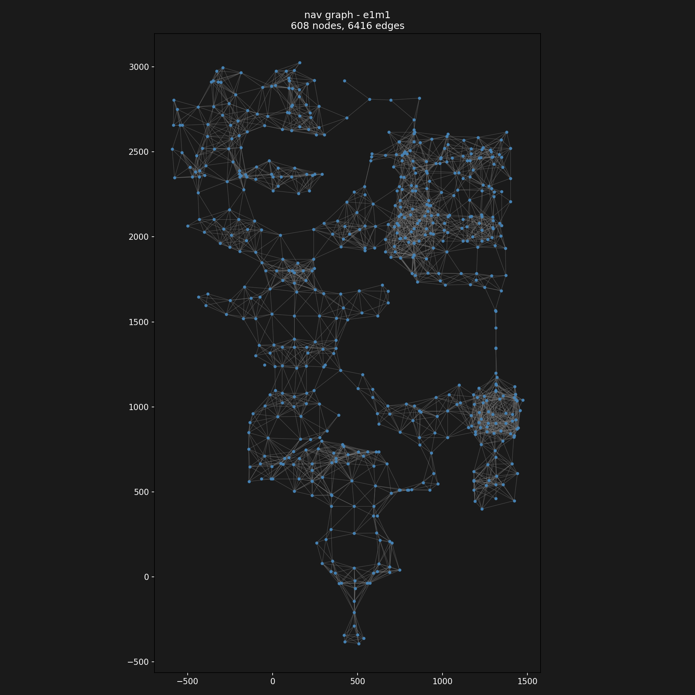

---

## Why euclidean isn't enough

The scatter plot below is the core motivation for the whole project. Every point is a source-goal pair. Points above the red line are cases where the true path cost is higher than the straight-line distance. The further above the line, the more A* is being misled by its heuristic.

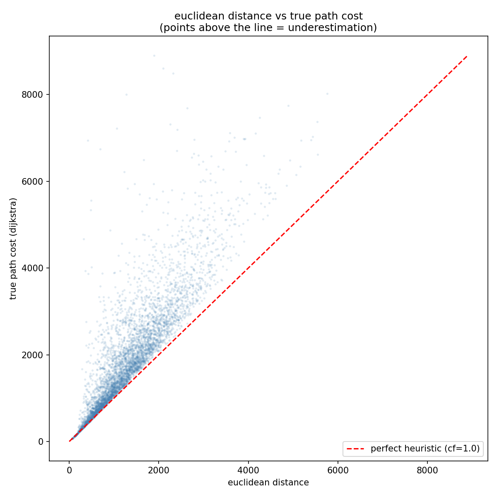

The correction factor distribution makes the same point more directly. The mean correction factor across all 38 maps is 1.46, meaning the true path is on average 46% longer than euclidean predicts. Some pairs have correction factors above 20.

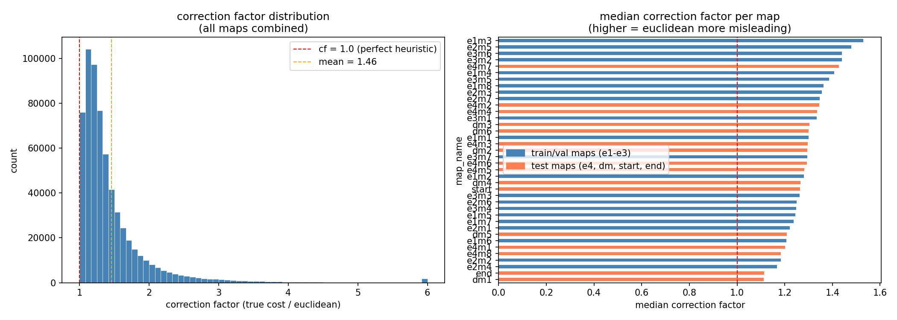

---

## Key results

| Method | Mean nodes expanded | Path cost ratio | Notes |
|---|---|---|---|
| Euclidean A* | 96.2 | 1.000 | Simple baseline |
| MLP A* | 56.7 | 1.020 | 42.4% fewer expansions |
| XGBoost A* | 56.9 | 1.020 | 42.2% fewer expansions |

Benchmarked across 38 maps with 1,000 queries each (38,000 total queries). The train/val/test split is by episode so the model never sees episode 4 or deathmatch maps during training, yet still achieves around 40% reduction on those unseen maps.

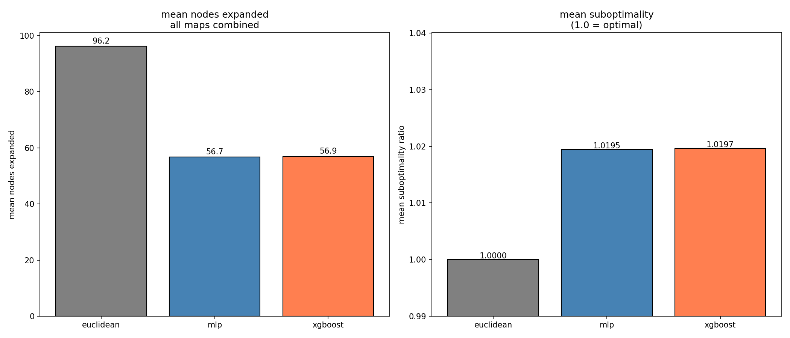

The scatter below shows every individual query across all 38 maps. Almost every point sits below the red no-improvement line, meaning the learned heuristic expands fewer nodes than euclidean on the vast majority of queries.

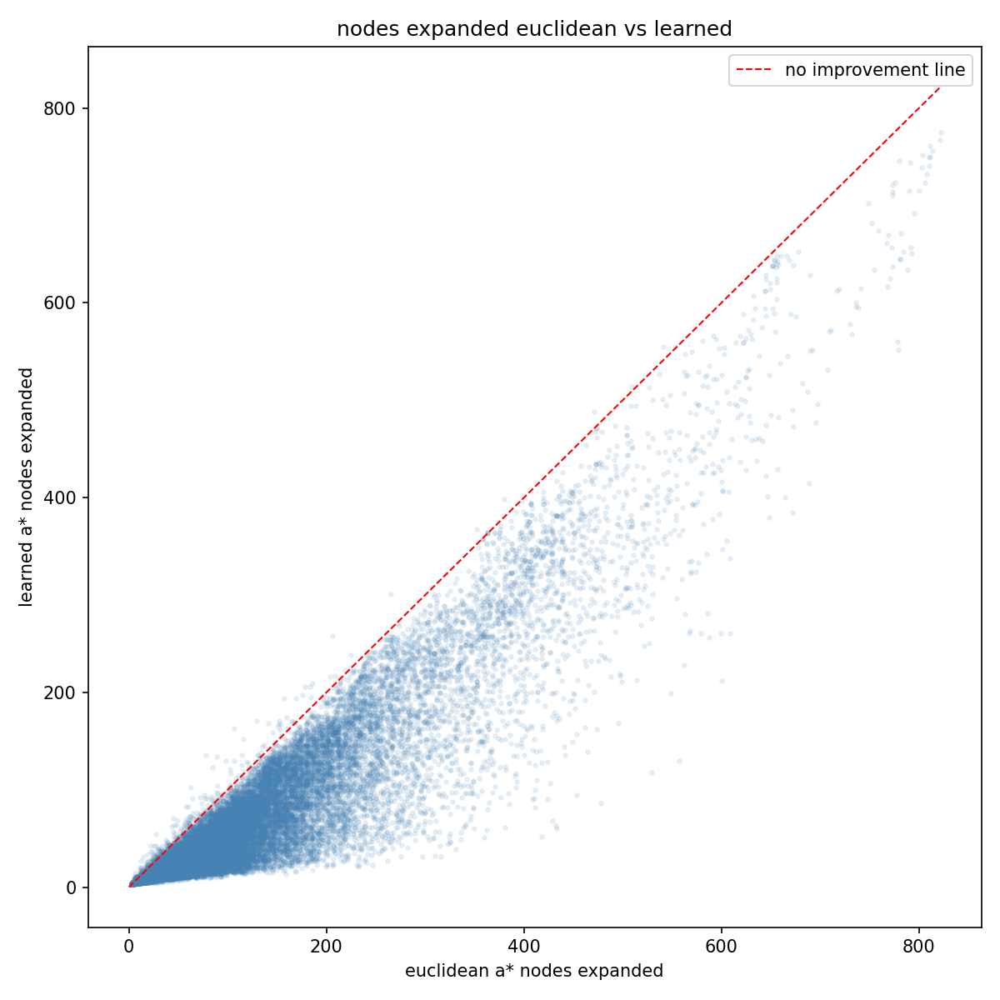

### Per-map breakdown

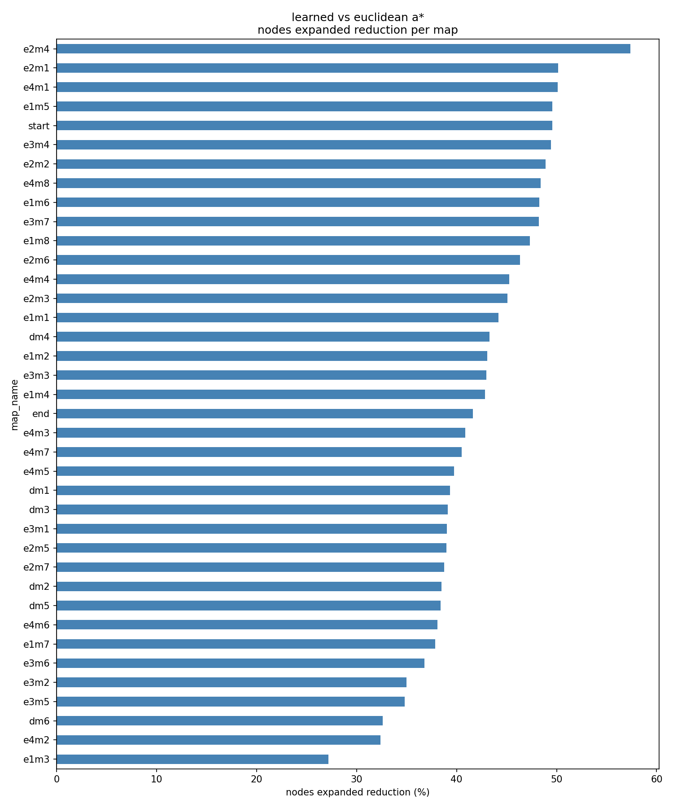

### Node reduction and suboptimality by train/val/test split

The left panel shows the reduction is consistent across all three splits, including the unseen test maps. The right panel shows the suboptimality distribution — the vast majority of paths are within 2.5% of optimal.

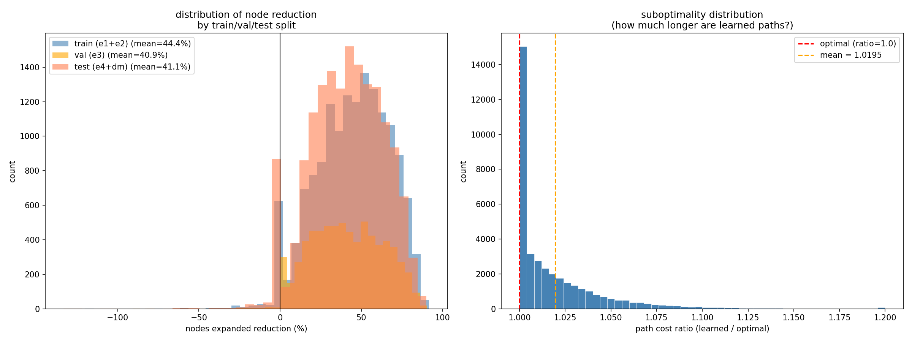

---

## MLP vs XGBoost

Both models achieve nearly identical results across all 38 maps. The bars are almost indistinguishable, which is itself an interesting finding.

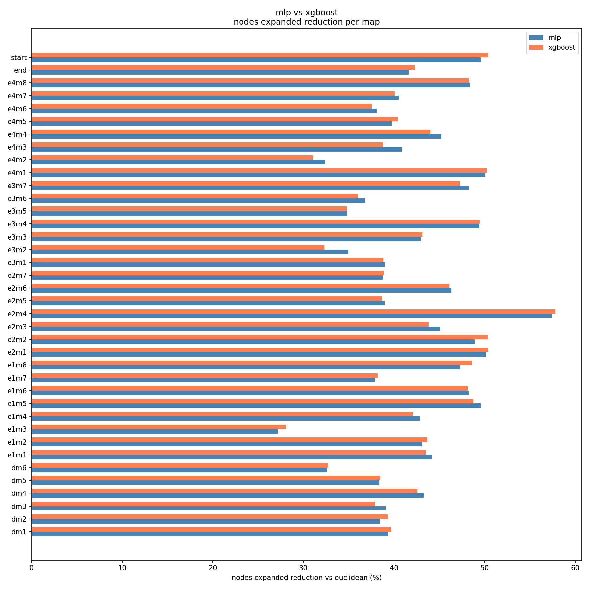

---

## Path comparison on e1m1

Side by side — euclidean A* on the left expanding 195 nodes, learned A* on the right expanding only 50 nodes on the same query. Same path, 74.4% fewer expansions.

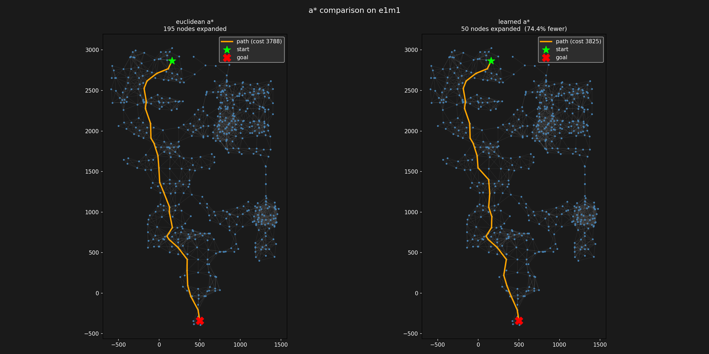

---

## Training

### MLP training curves

The MLP converges in around 25 epochs with early stopping. The gap between train and val loss reflects the geometric differences between episodes rather than overfitting.

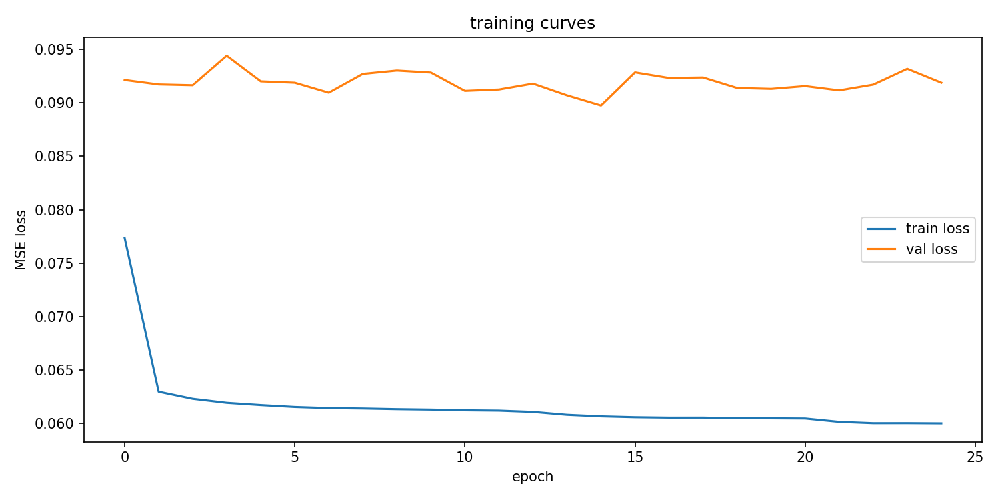

### XGBoost training curve

XGBoost converges even faster, reaching its best validation RMSE at iteration 34.

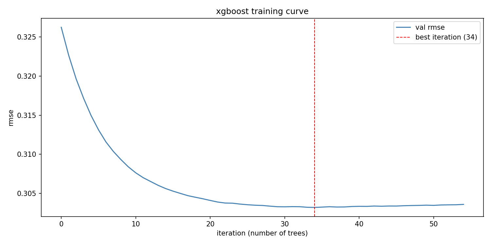

### XGBoost predictions on test maps

Predicted vs true correction factor on the held-out test maps. The model captures the bulk of the signal but understimates the extreme high-cf cases, which is expected given the right-skewed label distribution.

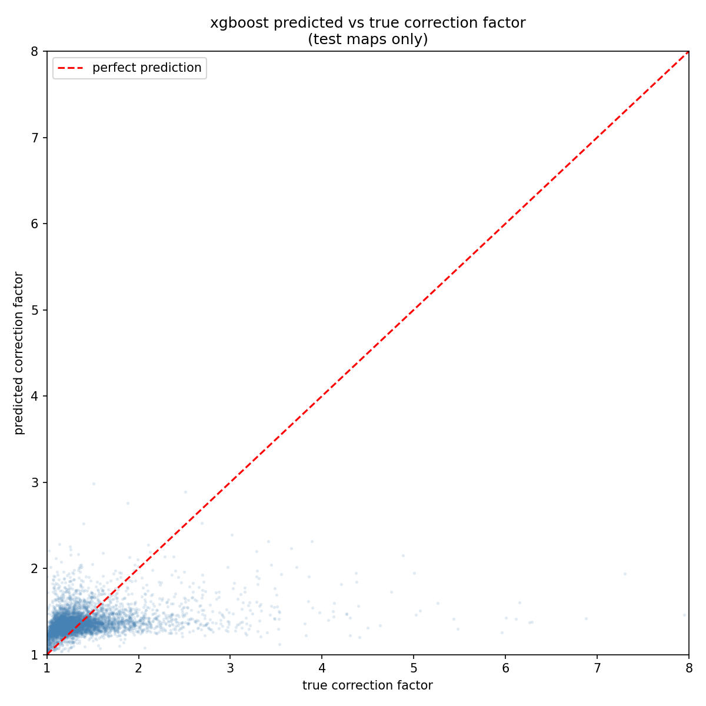

### Feature importance

Height features dominate — `height_ratio` and `height_diff` together account for nearly half the total gain. This makes intuitive sense since height differences are the main reason euclidean distance underestimates path cost in Quake geometry (you have to find a ramp or stairs rather than going straight up).

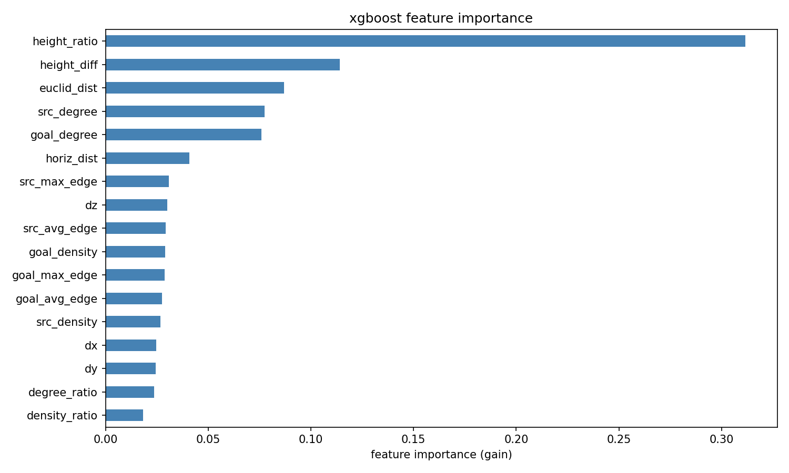

---

## Project structure

```
├── src/
│   ├── pak_reader.py          # PAK archive parser
│   ├── bsp_parser.py          # BSP v29 binary parser
│   ├── nav_graph.py           # Navigation graph construction
│   ├── astar.py               # A* with pluggable heuristic interface
│   ├── features.py            # Feature extraction
│   ├── model.py               # MLP definition and training
│   ├── learned_heuristics.py  # MLP heuristic wrapper
│   ├── xg_model.py            # XGBoost training
│   └── xg_heuristic.py        # XGBoost heuristic wrapper
│
├── scripts/
│   ├── generate_data.py       # Ground truth dataset generation
│   ├── benchmark.py           # MLP benchmark runner
│   ├── xg_benchmark.py        # 4-method comparison benchmark
│   ├── visualize.py           # Results plots and EDA
│   └── animate.py             # Animated A* search comparison (GIF)
│
├── data/                      # Generated datasets (not tracked)
├── checkpoints/               # Saved model weights (not tracked)
├── assets/                    # Plots and animation for README
└── plots/                     # All generated figures
```

---

## Setup

Requires Quake 1 game files (`pak0.pak` and `pak1.pak`) from the registered version. The shareware version (episode 1 only, 7 maps) also works for testing the pipeline.

```bash
python -m venv venv
venv\Scripts\activate        # Windows
source venv/bin/activate     # Linux/Mac

pip install numpy scipy networkx pandas pyarrow torch matplotlib scikit-learn tqdm pytest xgboost pillow
```

Then run the setup script to create the folder structure

```bash
python setup_project.py
```

---

## Running the pipeline

**Step 1 — Extract maps**

Update the PAK paths in `src/pak_reader.py` to point to your Quake installation, then run it directly. This extracts all `.bsp` files to `data/maps/`.

**Step 2 — Generate ground truth dataset**

```bash
python scripts/generate_data.py
```

Runs Dijkstra across sampled node pairs on all 38 maps using multiprocessing. Produces `data/ground_truth.parquet` with around 625k pairs.

**Step 3 — Extract features**

```bash
python src/features.py
```

Computes the 17-feature vector for each pair and saves to `data/features.parquet`.

**Step 4 — Train models**

```bash
python src/model.py      # MLP
python src/xg_model.py   # XGBoost
```

Both save their weights to `checkpoints/`. Training takes a few minutes on CPU with no GPU required.

**Step 5 — Run benchmark**

```bash
python scripts/xg_benchmark.py
```

Runs 1,000 queries per map comparing euclidean A*, MLP A*, and XGBoost A*. Results saved to `data/xgboost_benchmark_results.parquet`.

**Step 6 — Generate plots and animation**

```bash
python scripts/visualize.py
python scripts/animate.py
```

---

## Feature set

The 17 features fall into three groups.

**Spatial (7)** covers euclidean distance, horizontal distance, height difference, height ratio, and signed dx/dy/dz components.

**Source node context (5)** captures local node density within 150 units, degree, average edge length, and maximum edge length.

**Goal node context (5)** mirrors the source context. Two additional ratio features compare source and goal context directly.

The correction factor label is log-transformed before training to compress the right-skewed distribution and stabilise training.

---

## Design notes

**Why correction factors instead of raw costs**

Predicting the ratio `true_cost / euclidean_dist` rather than raw cost makes the label scale-invariant across maps of different sizes. It also grounds the prediction in a known lower bound so the network only needs to learn how much above 1.0 the true cost is.

**Admissibility**

The models are trained with an admissibility penalty on predictions below zero (correction factor below 1.0 is geometrically impossible). At inference time predictions are clamped to `cf >= 1.0`. This produces near-admissible rather than strictly admissible heuristics. Around 2% of paths are suboptimal by roughly 2% on average.

**Train/val/test split by map**

Splitting randomly by sample would leak map topology into the test set. The split is by episode — train on episodes 1 and 2, validate on episode 3, test on episode 4 and deathmatch maps.

**Why both MLP and XGBoost**

The near-identical results (42.4% vs 42.2% reduction) are the most informative outcome. They suggest that with these 17 hand-crafted features, the representation bottleneck dominates over model capacity. Richer features like BSP leaf membership or graph neighbourhood embeddings would likely improve both equally.

---

## Dependencies

```
numpy, scipy, networkx, pandas, pyarrow
torch, scikit-learn, xgboost
matplotlib, tqdm, pillow
```

---

## Potential extensions

- BSP structural features (leaf membership, leaf volume, same-leaf indicator)
- Graph neural network heuristic that learns directly from nav graph topology without hand-crafted features
- Getting an agent to actually play out the paths through PyQuake
